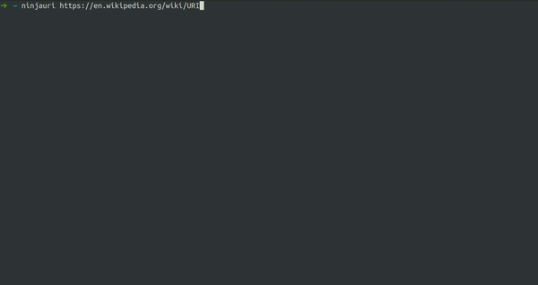

NinjaUri
========

NinjaUri is a simple data retrieval tool for URIs.

[](https://github.com/rovellipaolo/NinjaUri/actions)
[](https://coveralls.io/github/rovellipaolo/NinjaUri?branch=master)
[](https://lgtm.com/projects/g/rovellipaolo/NinjaUri/context:python)
[](https://www.gnu.org/licenses/gpl-3.0)




## Overview

NinjaUri uses `pythonwhois-alt` (https://github.com/kilgoretrout1985/pythonwhois-alt) and `tldextract` (https://github.com/john-kurkowski/tldextract) to extract a series of information from a given URI.


## Installation

The first step is cloning the NinjaUri repository, or downloading its source code.

```
$ git clone https://github.com/rovellipaolo/NinjaUri
$ cd NinjaUri
```

NinjaUri has two ways to be executed, in local environment or in Docker.

### Local
To execute NinjaUri in your local machine, you need `Python 3.6` or higher installed.
Just launch the following commands, which will install all the needed Python dependencies and add a `ninjauri` symlink to `/usr/local/bin/`.

```
$ make build
$ make install
$ ninjauri --help
```

### Docker
To execute NinjaUri in Docker, you need `Docker` installed.
To build the Docker image, launch the following commands:

```
$ make build-docker
$ docker run --name ninjauri -it --rm ninjauri:latest ninjauri --help
```


## Checkstyle

Once you've configured it (see the _"Installation"_ section), you can also run NinjaUri checkstyle as follows.

### Local
To run the checkstyle in your local machine, launch the following command:
```
$ make checkstyle
```
**NOTE:** This is using [`pylint`](https://github.com/PyCQA/pylint) under-the-hood.

You can also run the checkstyle automatically at every git commit by launching the following command:
```
$ make install-githooks
```

### Docker
To run the checkstyle in Docker, launch the following command:
```
$ make checkstyle-docker
```


## Tests

Once you've configured it (see the _"Installation"_ section), you can also run NinjaUri tests as follows.

### Local
To run the tests in your local machine, launch the following command:
```
$ make test
```

You can also run the tests with coverage by launching the following command:
```
$ make test-coverage
```

### Docker
To run the tests in Docker, launch the following command:
```
$ make test-docker
```


## Usage

The following are examples of running NinjaUri against a sample URI.

### Show URI summary
```
$ ninjauri https://en.wikipedia.org/wiki/URI
```
```
whois:
	servers:
		- whois.markmonitor.com
		- whois.pir.org
	emails:
		- abusecomplaints@markmonitor.com
hostname:    en.wikipedia.org
protocol:    https
path:        /wiki/URI
tld:         org
sld:         wikipedia
domain:      wikipedia.org
subdomain:   en
domain_id:   D51687756-LROR
status:
	- clientDeleteProhibited https://icann.org/epp#clientDeleteProhibited
	- clientTransferProhibited https://icann.org/epp#clientTransferProhibited
	- clientUpdateProhibited https://icann.org/epp#clientUpdateProhibited
registrar:   MarkMonitor Inc.
create_time: 2001-01-13 00:12:14
update_time: 2020-10-15 22:29:57
expire_time: 2023-01-13 00:12:14
nameservers:
	- ns0.wikimedia.org
	- ns1.wikimedia.org
	- ns2.wikimedia.org
registered:  True
```

### Show URI information in JSON format
```
$ ninjauri https://en.wikipedia.org/wiki/URI --json
```
```json
{
    "admin_contacts": {},
    "available": false,
    "billing_contacts": {},
    "create_time": "2001-01-13 00:12:14",
    "domain": "wikipedia.org",
    "domain_id": "D51687756-LROR",
    "expire_time": "2023-01-13 00:12:14",
    "hostname": "en.wikipedia.org",
    "nameservers": [
        "ns0.wikimedia.org",
        "ns1.wikimedia.org",
        "ns2.wikimedia.org"
    ],
    "path": "/wiki/URI",
    "port": "",
    "protocol": "https",
    "query": "",
    "raw": "https://en.wikipedia.org/wiki/URI",
    "registered": true,
    "registrant_contacts": {},
    "registrar": "MarkMonitor Inc.",
    "sld": "wikipedia",
    "status": [
        "clientDeleteProhibited https://icann.org/epp#clientDeleteProhibited",
        "clientTransferProhibited https://icann.org/epp#clientTransferProhibited",
        "clientUpdateProhibited https://icann.org/epp#clientUpdateProhibited"
    ],
    "subdomain": "en",
    "technical_contacts": {},
    "tld": "org",
    "update_time": "2020-10-15 22:29:57",
    "whois": {
        "emails": [
            "abusecomplaints@markmonitor.com"
        ],
        "raw": "Domain Name: WIKIPEDIA.ORG\r\nRegistry Domain ID: D51687756-LROR\r\nRegistrar WHOIS Server: whois.markmonitor.com\r\nRegistrar URL: http://www.markmonitor.com\r\nUpdated Date: 2020-10-15T22:29:57Z\r\nCreation Date: 2001-01-13T00:12:14Z\r\nRegistry Expiry Date: 2023-01-13T00:12:14Z\r\nRegistrar Registration Expiration Date:\r\nRegistrar: MarkMonitor Inc.\r\nRegistrar IANA ID: 292\r\nRegistrar Abuse Contact Email: abusecomplaints@markmonitor.com\r\nRegistrar Abuse Contact Phone: +1.2083895740\r\nReseller:\r\nDomain Status: clientDeleteProhibited https://icann.org/epp#clientDeleteProhibited\r\nDomain Status: clientTransferProhibited https://icann.org/epp#clientTransferProhibited\r\nDomain Status: clientUpdateProhibited https://icann.org/epp#clientUpdateProhibited\r\nRegistrant Organization: Wikimedia Foundation, Inc.\r\nRegistrant State/Province: CA\r\nRegistrant Country: US\r\nName Server: NS0.WIKIMEDIA.ORG\r\nName Server: NS1.WIKIMEDIA.ORG\r\nName Server: NS2.WIKIMEDIA.ORG\r\nDNSSEC: unsigned\r\nURL of the ICANN Whois Inaccuracy Complaint Form https://www.icann.org/wicf/)\r\n>>> Last update of WHOIS database: 2021-02-20T23:17:07Z <<<\r\n\r\nFor more information on Whois status codes, please visit https://icann.org/epp\r\n\r\nAccess to Public Interest Registry WHOIS information is provided to assist persons in determining the contents of a domain name registration record in the Public Interest Registry registry database. The data in this record is provided by Public Interest Registry for informational purposes only, and Public Interest Registry does not guarantee its accuracy. This service is intended only for query-based access. You agree that you will use this data only for lawful purposes and that, under no circumstances will you use this data to (a) allow, enable, or otherwise support the transmission by e-mail, telephone, or facsimile of mass unsolicited, commercial advertising or solicitations to entities other than the data recipient's own existing customers; or (b) enable high volume, automated, electronic processes that send queries or data to the systems of Registry Operator, a Registrar, or Afilias except as reasonably necessary to register domain names or modify existing registrations. All rights reserved. Public Interest Registry reserves the right to modify these terms at any time. By submitting this query, you agree to abide by this policy.\n\nThe Registrar of Record identified in this output may have an RDDS service that can be queried for additional information on how to contact the Registrant, Admin, or Tech contact of the queried domain name.\r\n",
        "servers": [
            "whois.markmonitor.com",
            "whois.pir.org"
        ]
    }
}
```


## Licence

NinjaUri is licensed under the GNU General Public License v3.0 (http://www.gnu.org/licenses/gpl-3.0.html).